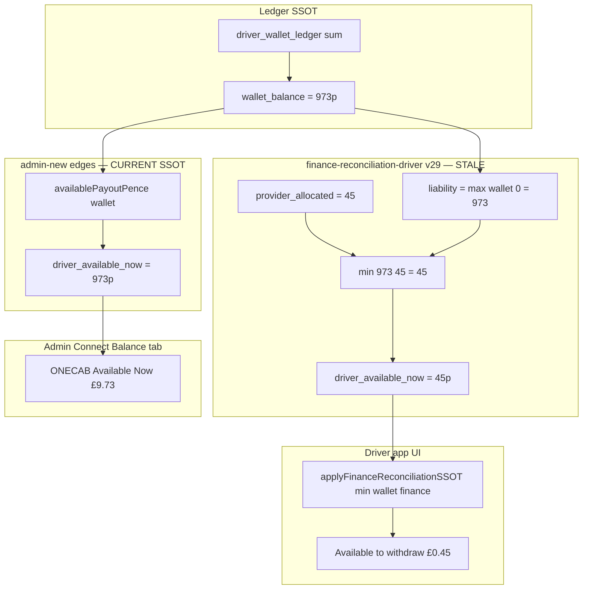

# P0 — `driver_available_now` SSOT Mismatch Audit

**Date:** 2026-06-24  
**Driver:** MK0001 (Ahmed Osman) — `5ed232c3-8bb5-4085-95d6-73e48e6c5e28`  
**Region:** MK — `7f611e59-a9e5-42c2-b65a-61376910bb5d`  
**Status:** Read-only audit — production evidence captured 2026-06-24T19:45Z  
**Severity:** P0 — driver-facing withdrawal amount disagrees with admin Connect Balance tab

---

## Executive summary

| Surface | MK0001 “available” shown | Pence |
|---------|--------------------------|------:|
| **Driver app** (wallet + payout + sidebar) | Available to withdraw | **45** (£0.45) |
| **admin-connect-payout-status** | ONECAB Available Now | **973** (£9.73) |
| **admin-finance-reconciliation** (per-driver) | `driver_available_now_pence` | **973** (£9.73) |

**Root cause:** Two different copies of `perDriverFinancialReconciliation.ts` are deployed to the same Supabase project.

- **admin-new** (deployed in `admin-connect-payout-status` v4, `admin-finance-reconciliation` v30) uses the **current SSOT**: `available_payout = max(wallet_balance, 0)`.
- **drive-hub-buddy** (still deployed in `finance-reconciliation-driver` v29) uses the **legacy formula**: `min(liability, provider_allocated) − in_flight`.

The driver app reads only `finance-reconciliation-driver`, so it shows the legacy **45p** value. The newly deployed admin Connect Balance tab reads `admin-connect-payout-status`, which uses the updated module and shows **973p**.

**Authoritative value:** **973p (£9.73)** per `admin-new/supabase/functions/_shared/payoutAvailability.ts` and the deployed admin finance edges. The driver path is **stale**.

---

## 1. Exact source by surface

### Driver app — wallet screen

| Step | Source |
|------|--------|
| Hook | `drive-hub-buddy/src/hooks/useDriverWalletSummary.ts` |
| Ledger payload | Edge `driver-wallet-summary` → `fetchDriverWalletSummary()` |
| Finance overlay | Edge `finance-reconciliation-driver` → `fetchFinanceReconciliationDriver()` |
| Cap logic | `applyFinanceReconciliationSSOT()` in `drive-hub-buddy/src/lib/driverWalletSummaryModel.ts` |
| Display field | `walletAvailableBalancePence(summary)` → **Available to withdraw** |

```typescript
// applyFinanceReconciliationSSOT — caps UI to finance SSOT
cappedAvailable = Math.min(walletAvailable, Math.max(0, financeAvailable));
```

Wallet page (`Wallet.tsx`) uses the same fetch + overlay path (not a separate formula).

### Driver app — payout / cash-out screen

Same as wallet: `Wallet.tsx` reads `walletAvailableBalancePence(walletSummary)` after the finance overlay. Cash-out dialog label: **Available to withdraw**.

Sidebar (`Index.tsx` → `SideDrawer`) uses `useDriverWalletSummary().availableBalance` — same cache and overlay.

### `finance-reconciliation-driver` (driver edge)

| Item | Detail |
|------|--------|
| Repo / path | `drive-hub-buddy/supabase/functions/finance-reconciliation-driver/index.ts` |
| Shared module | `drive-hub-buddy/supabase/functions/_shared/perDriverFinancialReconciliation.ts` |
| Production version | **v29** (unchanged since admin Connect deploy) |
| Formula | `perDriverAvailableNowPence({ liability, providerAllocated, inFlight })` |

```typescript
// LEGACY (drive-hub-buddy) — still live in production
const capped = Math.min(Math.max(0, liability), Math.max(0, providerAllocated));
return Math.max(0, capped - inFlight);
```

### `admin-connect-payout-status` (admin edge)

| Item | Detail |
|------|--------|
| Repo / path | `admin-new/supabase/functions/admin-connect-payout-status/index.ts` |
| Shared module | `admin-new/supabase/functions/_shared/perDriverFinancialReconciliation.ts` |
| Production version | **v4** (deployed 2026-06-24) |
| Display field | `onecab_available_now_pence` ← `finance.driver_available_now_pence` |
| Formula | `availablePayoutPence(walletBalance)` = `max(wallet_balance, 0)` |

### Admin — Financial Reconciliation page

| UI area | Backend | MK0001 value |
|---------|---------|--------------|
| Reconciliation tab — per-driver API | `admin-finance-reconciliation?driver_id=…` | **973p** (new SSOT) |
| Reconciliation tab — “Driver Available Now” card | `finance-backend-audit-v1` (region aggregate) | **2403p** region sum (not per-driver) |
| Connect Balance tab — “ONECAB Available Now” | `admin-connect-payout-status` | **973p** |

Note: the Reconciliation tab metric subtitle still says `min(liability, provider available)` in `FinancialReconciliation.tsx` — that text is **stale** and does not match the deployed admin per-driver SSOT.

---

## 2. Production JSON — MK0001 (2026-06-24T19:45Z)

### `finance-reconciliation-driver` (driver JWT — what the app uses)

```json
{
  "finance_reconciliation_driver_ssot": {
    "driver_available_now_pence": 45,
    "driver_remaining_liability_pence": 973,
    "provider_available_balance_allocated_to_driver_pence": 45,
    "in_flight_cashout_pence": 0,
    "reconciliation_status": "RECONCILIATION_MISMATCH",
    "payout_blocked": false
  }
}
```

### `driver-wallet-summary` (pre-overlay)

```json
{
  "net_balance_pence": 973,
  "available_now_pence": 973,
  "available_pence": 973
}
```

### Driver app simulated overlay

```
walletAvailable     = 973
financeAvailable    = 45   (from finance-reconciliation-driver)
cappedAvailable     = min(973, 45) = 45
→ UI shows £0.45
```

### `admin-connect-payout-status`

```json
{
  "driver_code": "MK0001",
  "wallet_balance_pence": 973,
  "onecab_available_now_pence": 973,
  "awaiting_settlement_pence": 0,
  "connect_available_pence": 1449,
  "connect_pending_pence": 681,
  "reconciliation_status": "RECONCILIATION_MISMATCH",
  "manual_connect_payout_allowed": false
}
```

### `admin-finance-reconciliation?driver_id=5ed232c3-…`

```json
{
  "finance_reconciliation_driver_ssot": {
    "driver_available_now_pence": 973,
    "driver_wallet_balance_pence": 973,
    "driver_remaining_liability_pence": 973,
    "provider_available_balance_allocated_to_driver_pence": 45,
    "in_flight_cashout_pence": 0
  }
}
```

### Platform context (why legacy formula yields 45p)

| Input | Pence | GBP |
|-------|------:|----:|
| MK0001 ledger wallet | 973 | £9.73 |
| Platform Stripe `balance.available` (region) | 45 | £0.45 |
| Provider balance allocated to MK0001 | 45 | £0.45 |
| Legacy `min(973, 45) − 0` | **45** | **£0.45** |
| Current SSOT `max(973, 0)` | **973** | **£9.73** |

---

## 3. Which value is authoritative?

**Authoritative: 973p (£9.73)**

Declared in `admin-new/supabase/functions/_shared/payoutAvailability.ts`:

```typescript
/** Authoritative: available payout = max(walletBalance, 0). The ONLY availability formula. */
export function availablePayoutPence(walletBalancePence: number): number {
  return Math.max(0, walletBalancePence);
}
```

`admin-new/supabase/functions/_shared/financialReconciliationSSOT.ts` documents removal of legacy `perDriverAvailableNowPence`.

Deployed admin edges (`admin-finance-reconciliation` v30, `admin-connect-payout-status` v4) already implement this.

**Stale / non-authoritative for display:** 45p from `finance-reconciliation-driver` v29 — legacy provider-allocation cap still bundled in the drive-hub-buddy function deployment.

**Important:** Provider allocation (45p) remains relevant for **funding diagnostics** and soft warnings, but must not be a second “available to withdraw” formula once SSOT is unified.

---

## 4. Checks performed

| Check | Finding |
|-------|---------|
| **Cache** | Driver app in-memory cache (`useDriverWalletSummary`) stores post-overlay value; not the root cause — fresh API calls reproduce 45p |
| **Stale edge deployment** | **Yes — primary cause.** `finance-reconciliation-driver` v29 uses drive-hub-buddy shared code; admin edges use admin-new shared code |
| **Different service area allocation** | Region peer allocation runs in both paths; MK0001 receives full 45p platform available because regional liability allocation assigns it there — affects **legacy** formula only |
| **Different finance module** | **Yes.** Two copies of `perDriverFinancialReconciliation.ts` with incompatible `driver_available_now` logic |
| **Duplicated calculation** | **Yes.** Legacy `perDriverAvailableNowPence` (drive-hub-buddy) vs `availablePayoutPence` (admin-new) |

### Deployed function versions (same project `thazislrdkjpvvghtvzo`)

| Function | Version | SSOT formula |
|----------|---------|--------------|
| `finance-reconciliation-driver` | v29 | Legacy provider cap |
| `driver-wallet-summary` | v321 | Ledger only (973p pre-overlay) |
| `admin-finance-reconciliation` | v30 | Current `max(wallet, 0)` |
| `admin-connect-payout-status` | v4 | Current `max(wallet, 0)` |

---

## 5. Calculation path diagram



---

## 6. Required fix

### P0 — align production edges (no formula change needed in admin-new)

1. **Sync shared finance SSOT from admin-new → drive-hub-buddy**
   - `perDriverFinancialReconciliation.ts`
   - `financialReconciliationSSOT.ts` (remove / stop exporting `perDriverAvailableNowPence`)
   - `payoutAvailability.ts` (if not already mirrored)
   - Any dependent tests

2. **Redeploy `finance-reconciliation-driver`** from the aligned codebase to project `thazislrdkjpvvghtvzo`.

3. **Verify MK0001** after deploy:
   - `finance-reconciliation-driver` → `driver_available_now_pence: 973`
   - Driver app → Available to withdraw **£9.73**
   - `admin-connect-payout-status` → ONECAB Available Now **£9.73** (unchanged)

### P1 — admin UI / docs cleanup

4. Update Financial Reconciliation metric subtitle in `FinancialReconciliation.tsx` from `min(liability, provider available)` to `max(wallet_balance, 0)`.

5. Update stale header comment in `financeBackendAuditV1.ts` line 7 (code already uses new formula; comment contradicts implementation).

6. Reconcile or supersede `drive-hub-buddy/docs/DRIVER_PAYOUT_SSOT_AUDIT.md` — it documents 45p as intentional withdrawal cap under the **old** provider-capped model.

### Guardrail (prevent recurrence)

7. Add a CI check that `drive-hub-buddy` and `admin-new` `perDriverFinancialReconciliation.ts` hashes match, or consolidate to a single shared package deployed to both function bundles.

---

## 7. Acceptance test (post-fix)

All surfaces must show **the same** MK0001 available amount (**973p / £9.73** unless wallet changes):

| # | Surface | How to verify |
|---|---------|---------------|
| 1 | Admin → Financial Reconciliation → **Stripe Connect Balance** | MK0001 **ONECAB Available Now** = £9.73 |
| 2 | Admin → Financial Reconciliation → **Reconciliation** tab | Per-driver API / driver card = £9.73 |
| 3 | Driver app → **Wallet** | Available to withdraw = £9.73 |
| 4 | Driver app → **Cash out / payout** dialog | Available to withdraw = £9.73 |
| 5 | API | `finance-reconciliation-driver` `driver_available_now_pence` = `admin-connect-payout-status` `onecab_available_now_pence` |

### API smoke command (admin + driver tokens)

Compare:

- `POST /functions/v1/finance-reconciliation-driver` (driver auth)
- `POST /functions/v1/admin-connect-payout-status` body `{ "driver_id": "5ed232c3-8bb5-4085-95d6-73e48e6c5e28" }` (admin auth)

Both must return **973** for `driver_available_now_pence` / `onecab_available_now_pence`.

---

## 8. What this audit does **not** change

- Stripe Connect balance (£14.49 available on Connect) remains **visibility-only** on the admin Connect tab — not a withdrawal SSOT.
- Wallet balance (ledger entitlement) remains **973p** on all surfaces.
- `ADMIN_PAYOUT_STRIPE_EXECUTION_ENABLED` remains `false` until explicitly approved.
- Payout **execution** may still fail or require settlement if platform cash is insufficient — that is separate from the **display SSOT** alignment addressed here.

---

## Appendix — file references

| Role | Path |
|------|------|
| Current SSOT formula | `admin-new/supabase/functions/_shared/payoutAvailability.ts` |
| Current per-driver builder | `admin-new/supabase/functions/_shared/perDriverFinancialReconciliation.ts` |
| Legacy per-driver builder | `drive-hub-buddy/supabase/functions/_shared/perDriverFinancialReconciliation.ts` |
| Driver overlay | `drive-hub-buddy/src/lib/driverWalletSummaryModel.ts` → `applyFinanceReconciliationSSOT` |
| Driver edge | `drive-hub-buddy/supabase/functions/finance-reconciliation-driver/index.ts` |
| Admin Connect edge | `admin-new/supabase/functions/admin-connect-payout-status/index.ts` |
