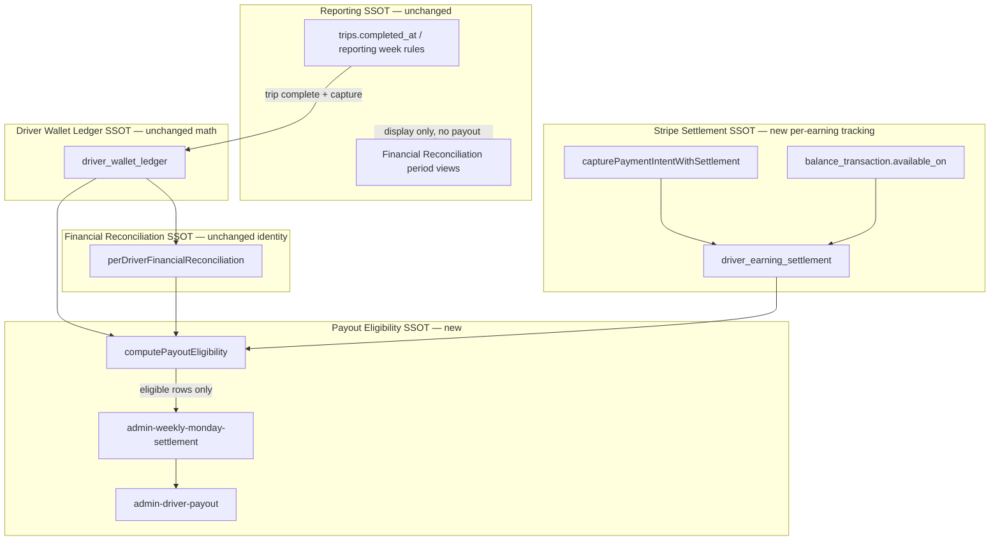

# Payout Eligibility Redesign Plan (P1)

**Status:** Approved for implementation  
**Audit basis:** [WEEKLY_PAYOUT_SETTLEMENT_ELIGIBILITY_AUDIT.md](./WEEKLY_PAYOUT_SETTLEMENT_ELIGIBILITY_AUDIT.md)  
**Accepted verdict:** Safe with clarity gaps — cash/card separation is sound; **payout eligibility** must align with Stripe settlement timing  
**Date:** 2026-06-25  
**Scope:** Redesign payout eligibility only — **no** commission formula, wallet balance math, cash/card separation, or reporting-week rule changes

---

## 1. Problem statement

Today weekly payout uses:

```text
payout_amount = max(lifetime wallet_balance, 0)
gate: platform_available > 0   ← binary, insufficient
```

This conflates:

| Concept | What it means today | What it should mean |
|---------|---------------------|---------------------|
| Reporting period | FR page `completed_at` filters | Unchanged — KPIs / commissions |
| Driver earnings | `driver_wallet_ledger` sum | Unchanged — what ONECAB owes |
| Stripe settlement | Partially checked at platform aggregate | What Stripe has **actually** made available per earning |
| Weekly payout | Full wallet when gate passes | What ONECAB can **safely pay today** |

---

## 2. Target architecture

### 2.1 Four independent SSOT layers



### 2.2 New payout eligibility formula

Replace binary `platform_available > 0` with:

```text
eligible_payout_amount_pence = min(
  driver_wallet_unpaid_pence,
  stripe_settled_unpaid_pence,
  finance_reconciled_unpaid_pence
)
```

Where:

| Term | Definition |
|------|------------|
| `driver_wallet_unpaid_pence` | Sum of **unpaid** balance-affecting ledger credits (card `TRIP_EARNING_NET`, `DRIVER_TIP_CREDIT`, adjustments, bonuses) minus already-allocated payout debits — **same types as today**, scoped to rows not linked to a **completed** payout allocation |
| `stripe_settled_unpaid_pence` | Sum of card earning rows where `settlement_status = 'settled'` and `paid_in_batch_id IS NULL` |
| `finance_reconciled_unpaid_pence` | If driver `payout_blocked` → `0`; else `driver_wallet_unpaid_pence` (FR does not inflate above wallet; it **blocks** when mismatched) |

**Hard rule:** Never pay more than Stripe has settled for included earnings.

**Cash trips:** Never require Stripe settlement. Eligibility follows existing cash workflow (commission debt / confirmed cash trip ledger) — excluded from `stripe_settled_unpaid` numerator; cash fare still not paid via Stripe card payout path.

### 2.3 Per-earning auditable state

Every card earning (`TRIP_EARNING_NET`, and tips `DRIVER_TIP_CREDIT` when linked to card capture) exposes:

| Field | Source |
|-------|--------|
| `trip_id` | `driver_wallet_ledger.related_trip_id` |
| `capture_time` | `payments.captured_at` or capture webhook timestamp |
| `stripe_transfer_id` | `stripeSettlement.ts` / ledger |
| `source_transaction` | Stripe charge ID used on SCT transfer |
| `settlement_status` | `pending` \| `settled` \| `failed` |
| `settled_at` | From Stripe `balance_transaction.available_on` when settled |
| `paid_in_batch_id` | Set when allocated to a **completed** weekly/manual payout |
| `eligible_for_payout` | Computed: all eligibility conditions true |

Reporting week (e.g. Sunday start → Monday complete = previous operational week) **does not** set `eligible_for_payout`.

---

## 3. Database design

### 3.1 New table: `driver_earning_settlement`

One row per **payable ledger credit** (card trip net + card tips). Does **not** alter ledger balance math.

```sql
CREATE TABLE public.driver_earning_settlement (
  id                    uuid PRIMARY KEY DEFAULT gen_random_uuid(),
  ledger_entry_id       uuid NOT NULL UNIQUE REFERENCES public.driver_wallet_ledger(id) ON DELETE CASCADE,
  driver_id             uuid NOT NULL REFERENCES public.drivers(id),
  trip_id               uuid REFERENCES public.trips(id),
  payment_id            uuid REFERENCES public.payments(id),

  -- Capture / transfer evidence (SCT)
  capture_time          timestamptz,
  stripe_charge_id      text,          -- source_transaction
  stripe_transfer_id    text,
  stripe_balance_tx_id  text,

  -- Settlement lifecycle
  settlement_status     text NOT NULL DEFAULT 'pending'
    CHECK (settlement_status IN ('pending', 'settled', 'failed')),
  stripe_available_on   timestamptz,   -- from balance_transaction.available_on
  settled_at            timestamptz,   -- when status became settled (sync time)

  -- Payout allocation
  paid_in_batch_id      uuid REFERENCES public.payout_batches(id),
  paid_in_payout_item_id uuid REFERENCES public.payout_items(id),
  paid_at               timestamptz,

  -- Denormalized gate (recomputed by job/edge; indexed for Monday batch)
  eligible_for_payout   boolean NOT NULL DEFAULT false,
  ineligible_reason     text,

  created_at            timestamptz NOT NULL DEFAULT now(),
  updated_at            timestamptz NOT NULL DEFAULT now()
);

CREATE INDEX idx_des_driver_eligible
  ON public.driver_earning_settlement (driver_id, eligible_for_payout)
  WHERE eligible_for_payout = true AND paid_in_batch_id IS NULL;

CREATE INDEX idx_des_settlement_pending
  ON public.driver_earning_settlement (settlement_status, stripe_available_on)
  WHERE settlement_status = 'pending';
```

**Why a companion table:** Keeps `driver_wallet_ledger` insert paths unchanged (stop-workflow, finalize-trip-and-capture, payout debits). Settlement metadata is additive.

### 3.2 New table: `payout_item_ledger_allocations`

Links payout items to **specific ledger credits** included in that payout (audit trail).

```sql
CREATE TABLE public.payout_item_ledger_allocations (
  id                uuid PRIMARY KEY DEFAULT gen_random_uuid(),
  payout_item_id    uuid NOT NULL REFERENCES public.payout_items(id) ON DELETE CASCADE,
  ledger_entry_id   uuid NOT NULL REFERENCES public.driver_wallet_ledger(id),
  amount_pence      integer NOT NULL CHECK (amount_pence > 0),
  created_at        timestamptz NOT NULL DEFAULT now(),
  UNIQUE (payout_item_id, ledger_entry_id)
);
```

### 3.3 Extend `payout_items` (optional columns)

```sql
ALTER TABLE public.payout_items
  ADD COLUMN IF NOT EXISTS wallet_unpaid_pence integer,
  ADD COLUMN IF NOT EXISTS stripe_settled_unpaid_pence integer,
  ADD COLUMN IF NOT EXISTS eligible_payout_pence integer,
  ADD COLUMN IF NOT EXISTS eligibility_snapshot jsonb;
```

Snapshot stores FR gate reasons at batch creation for diagnostics.

### 3.4 View: `v_driver_payout_eligibility_summary`

Per-driver roll-up for admin FR panel and edge functions:

```sql
-- wallet_unpaid, stripe_settled_unpaid, awaiting_settlement, eligible_payout, already_paid
```

Implemented as SQL view or RPC `get_driver_payout_eligibility(p_driver_id)` returning structured JSON.

### 3.5 RPC: `refresh_earning_settlement_status`

- Input: optional `driver_id`, `ledger_entry_id`
- Reads Stripe `balance_transaction.available_on` for pending rows
- Sets `settlement_status = 'settled'`, `settled_at = now()` when `available_on <= now()`
- Recomputes `eligible_for_payout` via shared TS logic (called from edge)

---

## 4. Eligibility rules (detailed)

A card earning becomes `eligible_for_payout = true` when **all** are true:

| # | Condition | Check |
|---|-----------|-------|
| 1 | Trip completed | `trips.completed_at IS NOT NULL` |
| 2 | Card payment captured | `payments.status IN (captured, paid, succeeded)` |
| 3 | Ledger entry exists | `driver_wallet_ledger` row present |
| 4 | FR balanced | Driver not `payout_blocked` (hard reasons only) |
| 5 | Stripe settled | `settlement_status = 'settled'` |
| 6 | Not already paid | `paid_in_batch_id IS NULL` |
| 7 | No hold | Driver not compliance/wallet-negative; no in-flight payout item for same rows |

**Cash earning path:** `CASH_COMMISSION_DEBT` / cash workflow — **never** requires Stripe settlement; weekly Stripe payout still excludes cash fare (unchanged). Cash commission recovery via existing `DEBT_RECOVERY` / card offset rules unchanged.

**Remove:** `if (providerAllocatedPence <= 0) hard block` as the **sole** settlement gate. Replace with `stripe_settled_unpaid_pence <= 0` → eligible amount 0 (soft block per driver, not misleading binary platform flag).

**Retain:** FR hard blocks (negative wallet, hard mismatch, ledger sync missing, reconstructed tier).

---

## 5. Affected edge functions

| Function | Change |
|----------|--------|
| **`admin-weekly-monday-settlement`** | Select drivers where `eligible_payout_pence > 0`; amount = `eligible_payout_pence` not full wallet; create `payout_item_ledger_allocations`; store eligibility snapshot on item |
| **`admin-driver-payout`** | Validate item amount matches sum of allocations; refuse if any allocated row no longer eligible; on success mark `driver_earning_settlement.paid_in_*`; remove dependency on binary platform gate for amount |
| **`perDriverFinancialReconciliation.ts`** | Add `computePayoutEligibility()` export; expose `stripe_settled_unpaid_pence`, `awaiting_settlement_pence`, `eligible_payout_pence`; **keep** wallet balance formula unchanged |
| **`payoutAvailability.ts`** | Add `eligiblePayoutPence()`; deprecate use of `availablePayoutPence()` **for weekly/manual execution amount** (keep for display alias) |
| **`financialReconciliationSSOT.ts`** | Remove / bypass `allocateProviderBalanceByLiability` for **payout amount** (retain for FR display / platform allocation reporting only) |
| **`stripeSettlement.ts`** | On SCT transfer success → upsert `driver_earning_settlement` with `charge_id`, `transfer_id`, `capture_time` |
| **`finalize-trip-and-capture`** / **`stop-workflow`** | After ledger insert → create `driver_earning_settlement` row (`pending`) |
| **`stripe-webhook`** (balance.transaction / charge) | Refresh settlement status when `available_on` reached |
| **`finance-reconciliation-driver`** | Return eligibility buckets (extends WALLET_STRIPE_BALANCE_CLARITY fields) |
| **`driver-wallet-summary`** | Pass through eligibility fields for driver UI |
| **`driver-early-cashout`** | Cap against `stripe_settled_unpaid` for selected allocations (instant path unchanged re: platform instant flag) |
| **`admin-finance-reconciliation`** | Per-driver drill-down: Wallet / Stripe Settled / Awaiting / Eligible / Already Paid |
| **`admin-connect-payout-status`** | Align labels with new eligibility SSOT |
| **New: `admin-sync-earning-settlement`** (optional) | Scheduled/manual Stripe refresh for pending rows before Monday batch |

**Deploy authority:** `admin-new` SSOT; mirror to `drive-hub-buddy` for parity tests only.

---

## 6. Admin UI changes

### Financial Reconciliation (per driver)

| Column | Source |
|--------|--------|
| Wallet Balance | `driver_wallet_balance_pence` (unchanged) |
| Stripe Settled | `stripe_settled_unpaid_pence` |
| Awaiting Settlement | `wallet_unpaid - stripe_settled_unpaid` (card only) |
| Eligible For Monday Payout | `eligible_payout_pence` |
| Already Paid | Sum of `paid_in_batch_id IS NOT NULL` |

Add drill-down table: each `TRIP_EARNING_NET` row with settlement fields from `driver_earning_settlement`.

### Driver wallet

| Section | Source |
|---------|--------|
| Wallet Balance | Ledger (unchanged) |
| Awaiting Stripe Settlement | `awaiting_settlement_pence` |
| Eligible For Next Weekly Payout | `eligible_payout_pence` |
| Instant Cash Out | Existing instant path + platform/service-area gates |

---

## 7. Shared module (new)

**Path:** `admin-new/supabase/functions/_shared/payoutEligibilitySSOT.ts`  
**Mirror:** `drive-hub-buddy/shared/payoutEligibilitySSOT.ts`

```typescript
export function computePayoutEligibility(input: {
  walletUnpaidPence: number;
  stripeSettledUnpaidPence: number;
  payoutBlocked: boolean;
  inFlightPayoutPence?: number;
}): {
  eligible_payout_pence: number;
  awaiting_settlement_pence: number;
  finance_reconciled_unpaid_pence: number;
};
```

Single function used by settlement, driver payout, FR edge, and tests.

---

## 8. Migration plan

### Phase 0 — Schema (no behaviour change)

1. Apply migration: `driver_earning_settlement`, `payout_item_ledger_allocations`, `payout_items` snapshot columns, indexes, RPC skeleton.
2. Deploy **read-only** backfill job.

### Phase 1 — Backfill historical rows

For each existing `TRIP_EARNING_NET` / card `DRIVER_TIP_CREDIT`:

1. Join `trips`, `payments`, existing `stripe_transfer_id` on ledger.
2. Call Stripe API for `balance_transaction.available_on` (batched, rate-limited).
3. Insert `driver_earning_settlement` with best-effort status.
4. Mark rows with completed `payout_items` + ledger debits as `paid_in_batch_id` retroactively where matchable.

**Est. volume:** Query prod count before run; batch 100/min Stripe reads.

### Phase 2 — Write path hookup

1. `stripeSettlement.ts` + trip completion paths create settlement rows on new earnings.
2. Webhook / cron refreshes `pending` → `settled`.
3. `eligible_for_payout` computed on write and on refresh.

### Phase 3 — Shadow mode

1. `admin-weekly-monday-settlement` computes **both** legacy amount and `eligible_payout_pence`.
2. Store comparison in `eligibility_snapshot`; **do not** change executed amount.
3. Run 2–3 Monday cycles in prod; ops review deltas.

### Phase 4 — Cutover

1. Feature flag: `PAYOUT_ELIGIBILITY_V2=true` in `admin_settings`.
2. Weekly batch + manual payout use `eligible_payout_pence` only.
3. Remove binary platform gate from payout amount path (keep platform balance on FR dashboard).

### Phase 5 — UI + driver app

1. Admin FR panel columns.
2. Driver wallet buckets (requires app release).

---

## 9. Rollout plan

| Week | Activity |
|------|----------|
| W1 | Schema migration + backfill script + unit tests |
| W2 | Write hooks (capture → settlement row) + refresh job |
| W3 | Shadow mode on Monday batch (compare only) |
| W4 | Enable `PAYOUT_ELIGIBILITY_V2` for Milton Keynes pilot region |
| W5 | All regions + admin UI |
| W6 | Driver app UI release |

**Pre-Monday checklist (ops):**

1. Run `refresh_earning_settlement_status` for all drivers (or region scope).
2. Verify FR panel: `eligible_payout` ≤ `stripe_settled`.
3. Run weekly settlement in `verification_mode` first.

---

## 10. Rollback plan

| Trigger | Action |
|---------|--------|
| Eligible amount systematically zero | Set `PAYOUT_ELIGIBILITY_V2=false` → revert to legacy wallet-based amount |
| Backfill errors | Settlement table is additive; legacy path ignores it when flag off |
| Stripe API rate limits | Pause refresh job; pending rows stay non-eligible (safe) |
| Critical over/under pay | Stop `admin-driver-payout` execution via existing `ADMIN_PAYOUT_STRIPE_EXECUTION_ENABLED=false` |

**No rollback requires dropping tables** — flag disables new logic. Drop tables only after 30-day stable period.

---

## 11. Performance impact

| Area | Impact | Mitigation |
|------|--------|------------|
| Monday batch driver loop | +1 eligibility query per driver (view/RPC) | Index on `(driver_id, eligible_for_payout)`; batch RPC |
| Settlement backfill | Stripe API N calls for historical rows | Off-peak batch; cache `balance_transaction` IDs on capture |
| Ongoing capture | +1 insert to `driver_earning_settlement` | Negligible |
| Webhook refresh | Updates on `balance.transaction` events | Debounce per charge |
| FR page | Extra columns + optional earning drill-down | Paginate; load drill-down on expand |
| Ledger integrity | Unchanged — no change to wallet triggers/cache | — |

**Expected Monday batch latency:** +50–200 ms per driver (DB only after backfill complete).

---

## 12. Production acceptance tests

### AT-1 — Sunday→Monday trip (card)

- Trip starts Sun 23:00, completes Mon 00:30, captured Mon 00:31.
- **Reporting:** Appears in previous operational week per existing FR period rule (unchanged).
- **Settlement row:** `pending` until Stripe `available_on`.
- **Monday 08:00 batch (before settle):** `eligible_for_payout = 0` for that earning; not in allocations.
- **After settlement refresh:** `eligible_for_payout = true`; included in **next** Monday batch.

### AT-2 — Tuesday trip, Friday settlement

- Card trip Tue; Stripe settles Fri.
- Not in Mon batch before Fri.
- Included in Mon batch **after** Fri settlement sync.

### AT-3 — Unsettled card

- Captured but `settlement_status = pending`.
- Never in `payout_item_ledger_allocations`.
- `eligible_payout_pence` excludes that amount.

### AT-4 — Cash trip

- `CASH_COMMISSION_DEBT` / cash workflow unchanged.
- No Stripe settlement required for cash fare.
- Cash fare not in Stripe weekly transfer amount.

### AT-5 — Financial Reconciliation panel

- Shows: Wallet | Stripe Settled | Awaiting | Eligible | Already Paid.
- Sum identity: `Wallet (card portion) ≈ Settled + Awaiting + Already Paid` (within tolerance).

### AT-6 — Weekly batch contents

- `payout_item_ledger_allocations` lists only rows with `eligible_for_payout = true` at batch time.
- `payout_items.eligible_payout_pence = SUM(allocations)`.

### AT-7 — FR hard block

- Reconciliation mismatch → driver `eligible_payout_pence = 0` even if Stripe settled.

### AT-8 — Partial wallet

- Wallet £9.73; Stripe settled £4.08 for unpaid earnings.
- `eligible_payout_pence = 408` (not 973).

### AT-9 — Already paid

- Earning in completed batch → `paid_in_batch_id` set → excluded from next run.

### AT-10 — Shadow mode regression

- With flag off, legacy amount still computed for comparison log.
- With flag on, legacy amount never executed.

---

## 13. Out of scope (explicit)

- Commission formulas
- `driver_wallet_ledger` balance calculation types
- Cash vs card separation rules
- Reporting week classification rules
- Instant Payout platform enablement (separate toggle work)
- Changing SCT capture transfer (`source_transaction` at capture remains)

---

## 14. Implementation sequence (engineering tickets)

| Ticket | Description | Depends |
|--------|-------------|---------|
| P1-1 | Migration + `payoutEligibilitySSOT.ts` + unit tests | — |
| P1-2 | Backfill script + Stripe refresh RPC | P1-1 |
| P1-3 | Capture hooks → `driver_earning_settlement` | P1-1 |
| P1-4 | `admin-weekly-monday-settlement` shadow + cutover flag | P1-2, P1-3 |
| P1-5 | `admin-driver-payout` allocation validation + mark paid | P1-4 |
| P1-6 | Remove binary gate from payout amount path | P1-5 |
| P1-7 | FR admin UI + driver wallet buckets | P1-4 |
| P1-8 | Prod acceptance test script + ops runbook | P1-5 |

---

## 15. Related documents

- [WEEKLY_PAYOUT_SETTLEMENT_ELIGIBILITY_AUDIT.md](./WEEKLY_PAYOUT_SETTLEMENT_ELIGIBILITY_AUDIT.md)
- [WALLET_STRIPE_BALANCE_CLARITY_SSOT.md](./WALLET_STRIPE_BALANCE_CLARITY_SSOT.md)
- [EARLY_CASHOUT_SERVICE_AREA_TOGGLE.md](./EARLY_CASHOUT_SERVICE_AREA_TOGGLE.md)
- [ONECAB_DRIVER_PAYOUT_INSTANT_SSOT.md](./ONECAB_DRIVER_PAYOUT_INSTANT_SSOT.md)

---

## 16. Sign-off

| Role | Decision |
|------|----------|
| Product / Ops | Approved P1 implementation plan (2026-06-25) |
| Engineering | Plan ready — begin P1-1 after ticket creation |
| Finance | Review shadow mode deltas before W4 cutover |

**Next step:** Implement P1-1 (schema + shared module + tests). No production payout behaviour change until Phase 3 shadow mode completes.
