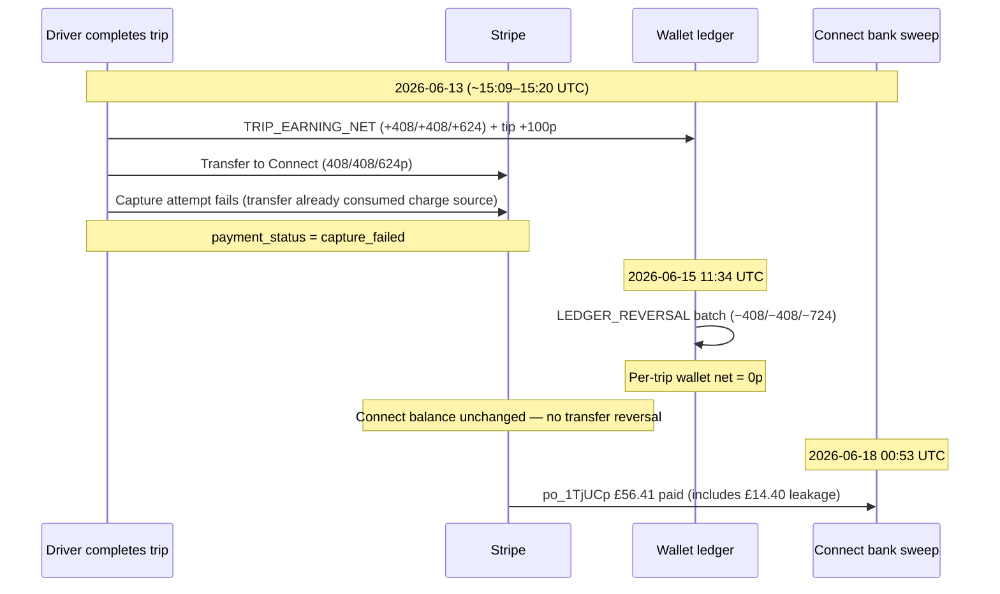

# Phase 3C.7 — MK0002 Reversal Leakage Audit

**Date:** 2026-06-18  
**Status:** Read-only — **no ledger writes, no Stripe actions**  
**Project:** `thazislrdkjpvvghtvzo` (ONECAB prod)  
**Driver:** MK0002 Asiya Wehliye (`cd8bae4c-3827-4b90-98c6-10be70eb0e52`)  
**Connect account:** `acct_1ThUR8Izd0dzmC0Y`  
**Parent payout:** `po_1TjUCpIzd0dzmC0Y65sJxUHu` — **£56.41** (5,641p), **paid** 2026-06-18 00:53 UTC  

**Objective:** Explain the **£14.40** gap between Stripe cash sent to MK0002 and wallet-backed liability for the same payout set.

---

## Executive conclusion

| Question | Answer |
|----------|--------|
| What is the £14.40 gap? | **1,440p** transferred to Stripe Connect on **three** card trips that later received **`LEDGER_REVERSAL`** (wallet net **0p** per trip). |
| Should the driver have received this money? | **No** — all three trips have `payment_status = capture_failed`; customer card was **not** successfully captured. |
| Was `LEDGER_REVERSAL` correct? | **Yes** — phantom `TRIP_EARNING_NET` / `DRIVER_TIP_CREDIT` were correctly zeroed (migration `20260715120000` + SSOT intent). |
| Is £14.40 recoverable? | **Partially / conditionally** — cash already left Connect via `po_1TjUCp`; recovery requires **finance action** (clawback, Stripe Connect adjustment, or write-off). |
| Recommended bundle treatment | **Split:** **−1,440p platform leakage write-off or clawback** separate from **−4,201p wallet-safe backfill** (see Phase 3C.6 Option 3). |

**Root cause (one sentence):** On 2026-06-13, platform→Connect **transfers succeeded before card capture completed**; capture then failed (Stripe source-amount conflict); ledger credits were reversed on 2026-06-15, but **Connect cash was never recalled** and was swept to the driver’s bank on 2026-06-18.

---

## 1. The £14.40 gap — exact arithmetic

Phase 3C.6 reconstructed `po_1TjUCp` from **twelve** platform→Connect transfers totalling **5,641p**:

| Bucket | Pence | £ |
|--------|------:|--:|
| **Stripe payout** (`po_1TjUCp`) | 5,641 | 56.41 |
| **Wallet-backed** portion (9 trips with positive per-trip ledger net) | 4,201 | 42.01 |
| **Reversal leakage** (3 trips with `LEDGER_REVERSAL`, wallet net 0) | **1,440** | **14.40** |

**Leakage sum (transfer amounts on reversed trips only):**

```
408p + 408p + 624p = 1,440p = £14.40
```

This is the **entire** unexplained slice of the MK0002 orphan payout that cannot be matched to current wallet SSOT. It is **not** pre-reset history (all trips completed 2026-06-13, driver created 2026-06-12).

---

## 2. Per-trip audit — three `LEDGER_REVERSAL` trips

### 2.1 Summary table

| Trip code | Trip ID (prefix) | Fare (customer) | Transfer | Reversal reason | Customer payment | Stripe transfer | Driver payout | Wallet impact |
|-----------|------------------|----------------:|---------:|-----------------|------------------|-----------------|---------------|---------------|
| **MK-260613-027** | `3afc4b99-…` | £4.80 (480p) | **£4.08** (408p) `tr_3Tht8UEeK1Cb9ZBx0E0VmMU6` | Card capture failed — reversing phantom driver credit | `capture_failed` | **Succeeded** → Connect; in `po_1TjUCp` | **Paid** (auto sweep 18 Jun) | +408p → −408p → **0p** |
| **MK-260613-028** | `1fb40710-…` | £4.80 (480p) | **£4.08** (408p) `tr_3ThtHqEeK1Cb9ZBx1YfyDmHN` | Card capture failed — reversing phantom driver credit | `capture_failed` | **Succeeded** → Connect; in `po_1TjUCp` | **Paid** (auto sweep 18 Jun) | +408p → −408p → **0p** |
| **MK-260613-029** | `da239600-…` | £7.34 fare + £1.00 tip (834p PI) | **£6.24** (624p) `tr_3ThtJZEeK1Cb9ZBx1BKDsYz7` | Card capture failed — reversing phantom driver credit (earning + tip) | `capture_failed` | **Succeeded** → Connect; in `po_1TjUCp` | **Paid** (auto sweep 18 Jun) | +624p +100p tip → −724p → **0p** |

**Driver:** MK0002 on all rows. **Ledger reversal timestamp (all three):** 2026-06-15 11:34:16 UTC (`20260715120000` batch backfill).

### 2.2 Trip MK-260613-027

| Field | Value |
|-------|-------|
| Completed | 2026-06-13 15:09:33 UTC |
| `TRIP_EARNING_NET` | +408p @ 15:09:40 |
| `LEDGER_REVERSAL` | −408p @ 2026-06-15 11:34:16 |
| `stripe_payment_intent_id` | `pi_3Tht8UEeK1Cb9ZBx05OgJ5HI` |
| `stripe_charge_id` | `ch_3Tht8UEeK1Cb9ZBx0z3QnUAq` |
| `stripe_settlement_verified` | `true` |
| `payments.last_error` | *Transfers using this transaction as a source must not exceed the source amount of £4.80. (There is already a transfer using this source, amounting to £4.08.)* |

| Decision | Verdict |
|----------|---------|
| Should driver have received money? | **No** |
| Was reversal correct? | **Yes** |
| Recoverable? | **£4.08** — already in driver bank via `po_1TjUCp` |
| **Recommended treatment** | **`clawback`** (or platform **`write-off`** if clawback impractical) |

### 2.3 Trip MK-260613-028

| Field | Value |
|-------|-------|
| Completed | 2026-06-13 15:16:21 UTC |
| `TRIP_EARNING_NET` | +408p @ 15:16:27 |
| `LEDGER_REVERSAL` | −408p @ 2026-06-15 11:34:16 |
| `stripe_payment_intent_id` | `pi_3ThtHqEeK1Cb9ZBx1o8wCaRr` |
| `stripe_charge_id` | `ch_3ThtHqEeK1Cb9ZBx1FZ7ZXsl` |
| `stripe_settlement_verified` | `true` |
| `payments.last_error` | Same transfer-exceeds-source pattern (£4.80 source, £4.08 already transferred) |

| Decision | Verdict |
|----------|---------|
| Should driver have received money? | **No** |
| Was reversal correct? | **Yes** |
| Recoverable? | **£4.08** |
| **Recommended treatment** | **`clawback`** (or **`write-off`**) |

### 2.4 Trip MK-260613-029

| Field | Value |
|-------|-------|
| Completed | 2026-06-13 15:19:53 UTC |
| `TRIP_EARNING_NET` | +624p @ 15:19:59 |
| `DRIVER_TIP_CREDIT` | +100p @ 15:20:00 |
| `LEDGER_REVERSAL` | −724p @ 2026-06-15 11:34:16 (reverses earning + tip) |
| `stripe_payment_intent_id` | `pi_3ThtJZEeK1Cb9ZBx1ZEAKyAp` |
| `stripe_charge_id` | `ch_3ThtJZEeK1Cb9ZBx1OQEeyh2` |
| `stripe_settlement_verified` | `true` |
| Transfer amount | **624p only** (driver net; tip was ledger-only, not transferred) |
| `payments.last_error` | *Transfers using this transaction as a source must not exceed the source amount of £7.34. (There is already a transfer using this source, amounting to £6.24.)* |

| Decision | Verdict |
|----------|---------|
| Should driver have received money? | **No** (fare not captured; tip likewise not collected) |
| Was reversal correct? | **Yes** (−724p correctly unwinds +624p +100p) |
| Recoverable? | **£6.24** transferred; **£1.00 tip** was never sent to Connect (ledger-only phantom) |
| **Recommended treatment** | **`clawback`** £6.24; tip portion **`no action`** beyond existing reversal |

---

## 3. Timeline — how leakage occurred



**Interpretation:**

1. **13 Jun** — Settlement path created **destination transfers** and credited ledger **before** capture was fully valid.
2. **13 Jun** — Capture failed with Stripe error: transfer already drawn from charge source (customer **not** charged).
3. **15 Jun** — Migration `20260715120000` inserted `LEDGER_REVERSAL` for all `capture_failed` card trips with phantom credits; wallet SSOT corrected to **0p** per trip.
4. **18 Jun** — Stripe auto-swept full Connect balance (**5,641p**) including the **1,440p** that ledger no longer supports.

**Process defect:** Ledger reversal did **not** trigger Connect transfer reversal or payout exclusion. Transfers are immutable cash movement; reversal was ledger-only.

---

## 4. Stripe evidence (read-only enumeration)

Source: `stripe-reconciliation-audit` prod run (JSON archived 2026-06-18).

| Transfer ID | Amount | Destination | In `po_1TjUCp`? |
|-------------|-------:|-------------|-----------------|
| `tr_3Tht8UEeK1Cb9ZBx0E0VmMU6` | 408p | `acct_1ThUR8Izd0dzmC0Y` | Yes (part of 5,641p) |
| `tr_3ThtHqEeK1Cb9ZBx1YfyDmHN` | 408p | `acct_1ThUR8Izd0dzmC0Y` | Yes |
| `tr_3ThtJZEeK1Cb9ZBx1BKDsYz7` | 624p | `acct_1ThUR8Izd0dzmC0Y` | Yes |

| Payout | Amount | Status | Arrival |
|--------|-------:|--------|---------|
| `po_1TjUCpIzd0dzmC0Y65sJxUHu` | 5,641p | **paid** | 2026-06-18 |

Platform balance transactions show outbound transfers (−408/−408/−624) with no matching recall before payout.

---

## 5. Wallet / liability context (MK0002)

| Metric | Pence | Notes |
|--------|------:|-------|
| Wallet SSOT (ledger, excl. `PLATFORM_COMMISSION` / `CASH_TRIP_EARNING`) | **1,901** | Post–12 Jun earnings |
| In-payout trips — wallet-backed | **4,201** | Nine trips still positive after reversals |
| In-payout trips — reversal leakage | **1,440** | This audit |
| Full `po_1TjUCp` debit if applied naïvely | **−5,641** | Would drive wallet to **−3,740p** |

The **£14.40** gap is the portion of `po_1TjUCp` that **cannot** be backed by any current wallet line item.

---

## 6. Answers to audit questions (bundle + per trip)

### 6.1 Should the driver have received the money?

**No.** All three trips:

- `trips.payment_status = capture_failed`
- `payments.status = capture_failed`
- Capture failure message confirms **no successful customer charge**
- ONECAB ledger SSOT correctly shows **0p** driver entitlement per trip after reversal

The driver **did** receive **£14.40** via Stripe only because Connect transfers were not reversed when capture failed.

### 6.2 Was reversal correct?

**Yes.**

- Migration `20260715120000` §4 backfilled `LEDGER_REVERSAL` for `capture_failed` card trips with positive `TRIP_EARNING_NET` / `DRIVER_TIP_CREDIT`
- Descriptions match reversed ledger entry IDs
- Per-trip net wallet = **0p** — consistent with “no earnings without capture”
- `recordCardCaptureFailure` / `reversePhantomCardCreditsForTrip` (current code) encodes the same intent going forward

### 6.3 Is £14.40 recoverable?

| Recovery path | Feasibility | Notes |
|---------------|-------------|-------|
| **Clawback** from driver | Medium | Cash in driver bank account; requires finance/legal process + driver communication |
| **Stripe Connect adjustment** | Low–medium | Payout already **paid**; would need debit from Connect balance or manual platform recovery |
| **Ledger-only “recovery”** | **No** | Wallet already 0 on these trips; no liability to debit |
| **Platform write-off** | High (operational) | Accept **£14.40** as process-loss from test-period settlement bug |

**Conclusion:** Economically recoverable **only via off-ledger action** (clawback or Stripe ops). Not recoverable by wallet backfill alone.

### 6.4 Recommended treatment

| Trip | Amount at risk | Treatment | Rationale |
|------|---------------:|-----------|-----------|
| MK-260613-027 | £4.08 | **`clawback`** (alt. **`write-off`**) | Uncaptured card; transfer should not have settled |
| MK-260613-028 | £4.08 | **`clawback`** (alt. **`write-off`**) | Same |
| MK-260613-029 | £6.24 transferred (+ £1.00 tip ledger-only) | **`clawback`** £6.24; tip **`no action`** | Only 624p hit Connect; tip reversal already complete |
| **Bundle (finance decision)** | **£14.40** | **`adjustment`** in remediation plan: treat as **non-wallet** component of `po_1TjUCp` | Aligns with Phase 3C.6 Option 3 |

**Do not** apply a **−1,440p `WEEKLY_PAYOUT` ledger debit** — there is no wallet liability to clear; that would **over-debit** MK0002.

**Do** apply **−4,201p** wallet-safe backfill separately (Phase 3C.6) after finance sign-off.

---

## 7. Process recommendations (no execution in this phase)

1. **Block Connect transfer** until `payment_status = captured` (or equivalent verified settlement).
2. On `capture_failed`, invoke **transfer reversal** (or prevent transfer creation) — not ledger-only reversal.
3. Exclude `capture_failed` / reversed trips from Connect balance available for auto-sweep.
4. Reconcile `stripe_transfer_id` on trips against ledger net **before** payout eligibility.

---

## 8. GO / NO-GO

| Action | GO? |
|--------|-----|
| Explain £14.40 gap | **Complete** (this document) |
| Ledger debit **−1,440p** for leakage | **NO-GO** — no wallet basis |
| Finance clawback / write-off decision | **Pending** Ahmed/finance |
| MK0002 full **−5,641p** backfill | **NO-GO** (Phase 3C.6) |
| MK0002 **−4,201p** wallet-safe backfill | **GO** conditional on 3C.4 deploy + sign-off |
| Stripe transfer reversal (historical) | **NO-GO** in read-only phase |

---

## 9. References

- `docs/PHASE_3C6_PRE_RESET_PAYOUT_ATTRIBUTION_AUDIT.md` — parent payout reconstruction
- `docs/PHASE_3C5_HISTORICAL_PAYOUT_REMEDIATION_AUDIT.md` — orphan classification
- `docs/PHASE_3C4_STRIPE_RECONCILIATION_AUDIT.md` — Stripe vs DB
- `supabase/migrations/20260715120000_p0_finance_ledger_ssot.sql` — `LEDGER_REVERSAL` backfill
- `supabase/functions/_shared/onecabFinanceLedger.ts` — `recordCardCaptureFailure`, `reversePhantomCardCreditsForTrip`
- Prod queries 2026-06-18 (service role): trips `3afc4b99`, `1fb40710`, `da239600`
- Stripe enumeration: `stripe-reconciliation-audit` → `po_1TjUCp`, transfers `tr_3Tht8U*`, `tr_3ThtHq*`, `tr_3ThtJZ*`

---

## 10. Sign-off block

| Role | Decision | Date |
|------|----------|------|
| Engineering | Gap explained; reversal correct; leakage = transfer-without-capture | 2026-06-18 |
| Finance | Clawback vs write-off for **£14.40** | _Pending_ |
| Ops | Historical Stripe recovery | _Pending_ |

**Audit mode:** Read-only. No ledger writes. No Stripe actions.
